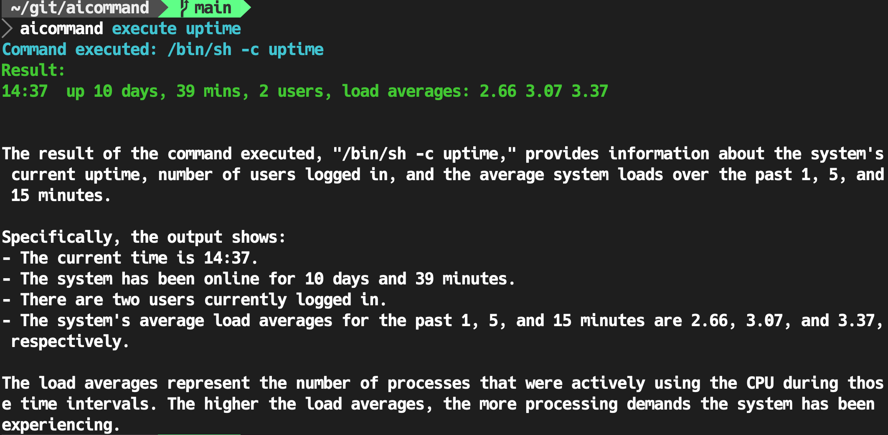

<div align="center">
  <div>
    
    <h1 align="center">AI Command</h1>
  </div>
  <div>
    🗣A CLI that uses AI to explain command results
  </div>
</div>

# Setup 🔧
Install aicommand:
```bash
go install github.com/nwiizo/aicommand@latest
```

Set the your_api_key:
```bash
export OPENAI_API_KEY=your_api_key
```

# Usage ⏳
Run commands without options like this:
```bash
aicommand execute uptime
```

Run commands options like this:
```bash
aicommand execute "ls -al"
```

# Note 📝
This application uses OpenAI's GPT models. Usage must comply with OpenAI's terms of use and policies.

Furthermore, this is a tool for interpreting the results of shell command execution. The developers assume no responsibility for the results or interpretation of the commands.
